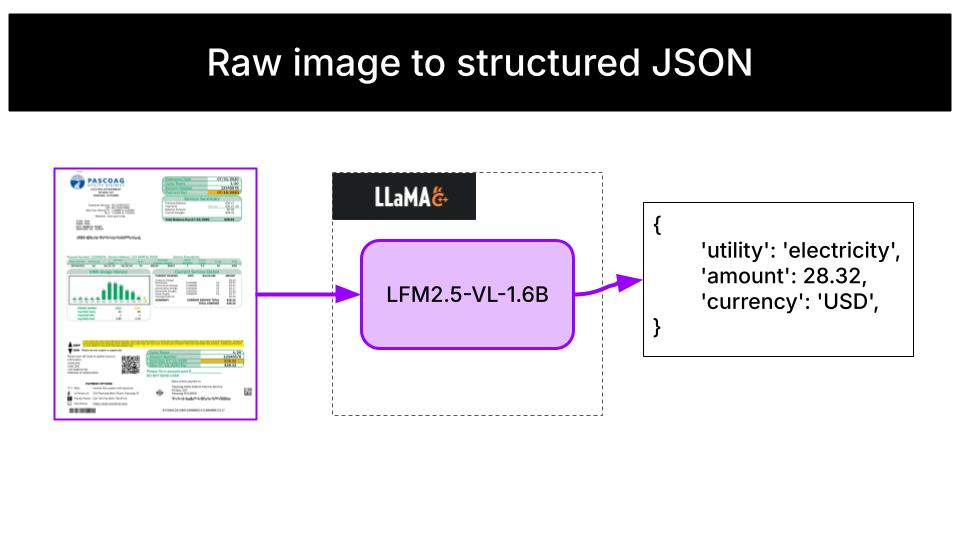

# Invoice extractor tool

[](https://discord.com/invite/liquid-ai)

A Python CLI that extracts payment details from invoice PDFs.



This is a practical example of building local AI tools and apps with

- No cloud costs
- No network latency
- No data privacy loss

## Table of contents

- [What's inside?](#whats-inside)
- [Understanding the architecture](#understanding-the-architecture)
- [Environment setup](#environment-setup)
  - [Install llama.cpp](#install-llamacpp)
  - [Install UV](#install-uv)
- [How to run it?](#how-to-run-it)
  - [Watch mode](#watch-mode)
  - [Process mode](#process-mode)
- [Results](#results)
- [Next steps](#next-steps)
- [Need help?](#need-help)

## What's inside?

In this example, you will learn how to:

- **Set up local AI inference** using llama.cpp to run Liquid models entirely on your machine without requiring cloud services or API keys
- **Build a file monitoring system** that automatically processes new files dropped into a directory
- **Extract structured output from images** using LFM2.5-VL-1.6B, a small vision-language model.


## Environment setup

You will need

- [llama.cpp](https://github.com/ggerganov/llama.cpp) to serve the Language Models locally.
- [uv](https://docs.astral.sh/uv/) to manage Python dependencies and run the application efficiently without creating virtual environments manually.

### Install llama.cpp

<details>
<summary>Click to see installation instructions for your platform</summary>

**macOS:**
```bash
brew install llama.cpp
```

**Linux (build from source):**
```bash
git clone https://github.com/ggerganov/llama.cpp.git
cd llama.cpp
cmake -B build
cmake --build build --config Release
# Add build/bin to your PATH
```

**Windows:**
Follow the [instructions](https://github.com/ggml-org/llama.cpp/blob/master/docs/install.md) in the llama.cpp repository.

</details>

Verify that `llama-server` is available:
```bash
which llama-server
```

### Install UV

<details>
<summary>Click to see installation instructions for your platform</summary>

**macOS/Linux:**
```bash
curl -LsSf https://astral.sh/uv/install.sh | sh
```

**Windows:**
```powershell
powershell -ExecutionPolicy ByPass -c "irm https://astral.sh/uv/install.ps1 | iex"
```

</details>


## How to run it?

Let's start by cloning the repository:

```sh
git clone https://github.com/Liquid4All/cookbook.git
cd cookbook/examples/invoice-parser
```

The tool supports two modes: **watch** (continuous monitoring) and **process** (one-shot).

The tool automatically starts and stops `llama-server` for you — no need to run it separately.

### Watch mode

Run it as a background service that continuously monitors a directory and automatically parses invoice images as they land in the folder:
```sh
uv run python src/invoice_parser/main.py watch \
    --dir invoices/ \
    --image-model LiquidAI/LFM2.5-VL-1.6B-GGUF:Q8_0 \
    --output bills.csv \
    --process-existing
```

### Process mode

Process specific files or folders and exit:
```sh
# Process an entire folder
uv run python src/invoice_parser/main.py process \
    --image-model LiquidAI/LFM2.5-VL-1.6B-GGUF:Q8_0 \
    invoices/

# Process specific files
uv run python src/invoice_parser/main.py process \
    --image-model LiquidAI/LFM2.5-VL-1.6B-GGUF:Q8_0 \
    invoices/water_australia.png invoices/british_gas.png

# Save results to a CSV file
uv run python src/invoice_parser/main.py process \
    --image-model LiquidAI/LFM2.5-VL-1.6B-GGUF:Q8_0 \
    --output bills.csv \
    invoices/
```

Feel free to modify the path to the invoices directory and the model IDs to suit your needs.

If you have `make` installed, you can run the application with the following commands:
```sh
make run       # watch mode
make process   # one-shot process mode
```


## Results

You can run the tool with a sample of images under `invoices/` with

```
uv run python src/invoice_parser/main.py process \
    --image-model LiquidAI/LFM2.5-VL-1.6B-GGUF:Q8_0 \
    invoices/
```
or, if you have Make installed in your system, just do
```
make process
```

Results are then printed on console. The model correctly extracts all 4 out of 4 invoices:

| File | Utility | Amount | Currency |
|------|---------|--------|----------|
| water_australia.png | water | 68.46 | AUD |
| Sample-electric-Bill-2023.jpg | electricity | 28.32 | USD |
| castlewater1.png | water | 436.55 | GBP |
| british_gas.png | electricity | 81.31 | GBP |


## Next steps

The model works perfectly out-of-the-box on our sample of invoices. However, depending on your specific invoice formats and layouts, you may encounter cases where the extraction is not accurate enough.

In those cases, you can fine-tune the model on your own dataset to improve accuracy. Check out the [fine-tuning notebook for Vision Language Models](../../finetuning/notebooks/sft_for_vision_language_model.ipynb) to learn how.


## Need help?

Join the [Liquid AI Discord Community](https://discord.com/invite/liquid-ai) and ask.
[](https://discord.com/invite/liquid-ai)
